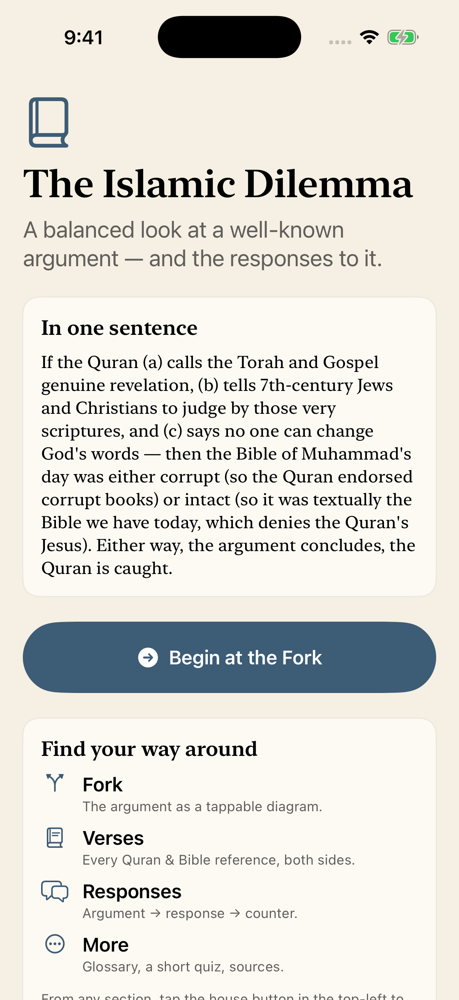
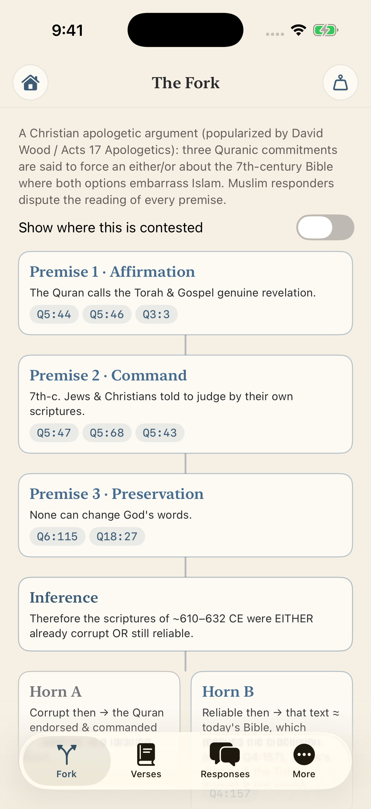
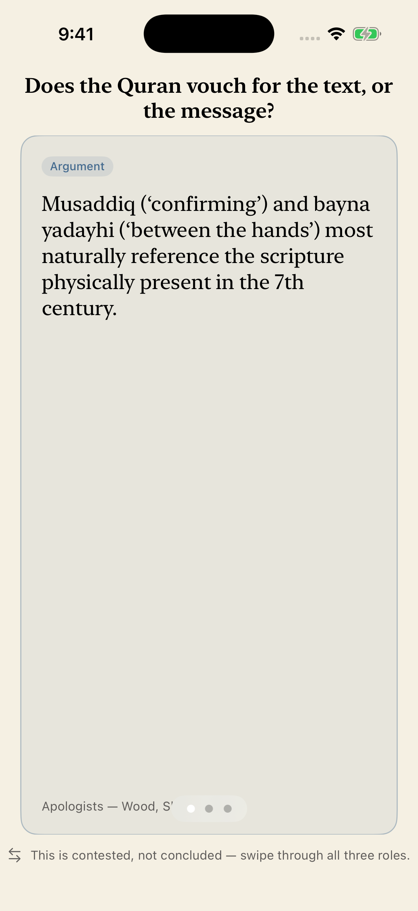

# The Islamic Dilemma — iOS

A balanced, educational SwiftUI app that walks through **"the Islamic Dilemma"** — a well-known argument in Christian–Muslim dialogue — and presents the Muslim scholarly responses to it on equal footing. It is a **reference explainer, not a verdict**: every claim is attributed to who makes it, and the app never declares a winner.

> This is a **mocked UI** — static Swift content, working navigation, no backend. Verse text is paraphrase-level (see *Accuracy & balance* below).

| Home | The Fork | Responses |
|------|----------|-----------|
|  |  |  |

## What it covers

The argument is a **constructive dilemma**:

- **P1 — Affirmation:** the Quran calls the Torah & Gospel genuine revelation (Q5:44, Q5:46, Q3:3).
- **P2 — Command:** it tells 7th-century Jews & Christians to *judge by* their own scriptures (Q5:47, Q5:68).
- **P3 — Preservation:** none can change God's words (Q6:115, Q18:27).
- **The fork:** so the Bible of Muhammad's day was either **corrupt** (→ the Quran endorsed corrupt books) or **reliable** (→ it's textually today's Bible, which affirms the crucifixion, contra Q4:157). Either way, the argument concludes, the Quran is caught.

The app gives the **Muslim responses** equal weight: *tahrif al-nass* vs *tahrif al-ma'ani* (text vs. meaning corruption), "confirm" = message not manuscript, Q5:47 as *ad hominem*, Injil ≠ the four Gospels, *muhaymin* + *naskh* supersession, and the Quran itself alleging tampering (Q2:79, Q4:46, Q5:13) — plus a neutral academic note on the manuscript record.

> **Full content reference:** [`docs/dilemma.md`](docs/dilemma.md) is the source-of-truth document for the complete theory, all responses, and every verse and term the app uses (mirrors `Sources/Content.swift`).

## App structure

- **Home** — a clean landing page (one-sentence summary, "find your way around") with a *Begin at the Fork* button.
- **Guided walkthrough** — 4 paged steps: Welcome → Premises → The Fork → Responses.
- **Explorer** (tab bar), each screen with a top-left home button:
  - **Fork** — the argument as a tappable diagram, with a "show where this is contested" toggle.
  - **Verses** — searchable/filterable browser of every reference; each detail shows *Apologists cite* / *Responders read* side by side, and a **tap opens the full verse** (original text + translation) in an in-app reader.
  - **Responses** — 7 topics, each a swipeable Argument → Response → Counter-reply deck.
  - **More** — glossary, a light quiz, About & Sources.

### Source files (`Sources/`)
| File | Contents |
|------|----------|
| `DilemmaApp.swift` | App entry point |
| `ContentView.swift` | Root gate: walkthrough → explorer |
| `Theme.swift` | Palette, reusable components, the custom explorer top bar, balance sheet |
| `Content.swift` | All static data — verses, debate decks, glossary, quiz, premises |
| `Walkthrough.swift` | The 4-step guided flow |
| `Explorer.swift` | Home landing, tabs, and all detail screens |

## Requirements

- macOS with **Xcode 26+** (built against iOS 26)
- **[XcodeGen](https://github.com/yonyz/XcodeGen)** — `brew install xcodegen` (the `.xcodeproj` is generated from `project.yml`)

## Run

```bash
./run.sh                 # auto-picks a simulator (prefers iPhone 17 Pro)
./run.sh "iPhone Air"    # or name any installed simulator
```

`run.sh` regenerates the project from `project.yml`, builds, boots the simulator, installs, launches, and writes `Dilemma-screenshot.png`.

## Read the sources yourself

Every reference is tappable and opens in an in-app browser (`SFSafariViewController`, with a Done button), so you read the actual text rather than the app's paraphrase. Sources were chosen to be reputable **and sect-neutral**, each with an independent failover:

| | Primary | Fallback |
|--|---------|----------|
| **Quran** (`Q5:47`) | [Quran.com](https://quran.com/5/47) — Uthmani/Hafs Arabic, user-selectable translation | [Al-Quran Cloud](https://alquran.cloud/ayah/5:47) — Tanzil-sourced |
| **Bible** (`Matthew 27`) | [BibleGateway](https://www.biblegateway.com/passage/?search=Matthew%2027&version=NRSVUE) — ecumenical NRSVUE, 200+ versions | [BibleHub](https://biblehub.com/matthew/27.htm) — Greek/Hebrew interlinear |

If the primary fails its initial load, the reader swaps to the fallback. The Saudi-state readers (King Fahd Complex, QuranEnc) and fragment-routed SPAs (Tanzil, STEP Bible) were deliberately avoided — the former for a Salafi editorial lean, the latter for fragile deep links. URL formats are the canonical, long-stable routes; they should be tap-tested on a real device (see below).

## Accuracy & balance

- Quran references use the standard **Hafs / Cairo (1924)** numbering; all citations were cross-checked.
- English is **paraphrase-level** — translations differ (Sahih International, Yusuf Ali, Pickthall). Verify wording against a chosen translation before quoting.
- Bible manuscript claims follow Metzger/Ehrman, Tov, Parker; Quranic-milieu scholarship follows Reynolds, Griffith, Neuwirth, Sinai. Manuscript dates are paleographic/radiocarbon estimates; "7th-c. Bible = today's Bible" means *no wholesale rewrite*, not identity in every detail.
- **Balance commitment:** every argument is paired with its strongest response; both traditions are steelmanned. The app presents a contested argument fairly and leaves the judgment to the reader.
